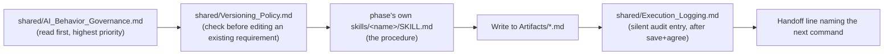

> **Priority: Reference.** Descriptive map of all six phases; does not add enforcement beyond `AI_Behavior_Governance.md`, `Execution_Logging.md`, and `Versioning_Policy.md`.

# SAP-SDLC Workflow Overview

## Purpose

This is the single map of the whole SAP-SDLC lifecycle — six chained phases, each triggered by its own slash command, each producing one frozen artifact that the next phase depends on. Use this file to answer "where am I in the process, what did the last phase produce, what do I read, and what comes next" without re-deriving it from six separate `SKILL.md` files.

This document is descriptive, not a new rule set. The actual enforcement lives in:
- [AI_Behavior_Governance.md](AI_Behavior_Governance.md) — mandatory behavior rules (highest priority)
- [Execution_Logging.md](Execution_Logging.md) — mandatory audit logging
- [Versioning_Policy.md](Versioning_Policy.md) — mandatory check for re-entering an already-completed requirement
- each phase's own `.claude/skills/<name>/SKILL.md` — the full procedure and Hard Gate

---

## Workflow Overview Map (pictorial)

```mermaid
flowchart TD
    Start([Business need arises]) --> Scope

    subgraph P1["Phase 1"]
        Scope["/Scope\nRequirement Gathering & Business Case"]
    end
    Scope -->|"writes BRD_&lt;name&gt;.md"| Gate1{BRD Frozen & Agreed?}
    Gate1 -->|No| Scope
    Gate1 -->|Yes| SA

    subgraph P2["Phase 2"]
        SA["/SolutionArchitect\nSolution Architecture"]
    end
    SA -->|"writes SolutionArchitect_&lt;name&gt;.md"| Gate2{Architecture Frozen & Agreed?}
    Gate2 -->|No| SA
    Gate2 -->|Yes| FS

    subgraph P3["Phase 3"]
        FS["/FunctionalSpec\nFunctional Design (per Object ID)"]
    end
    FS -->|"writes FunctionalSpec_&lt;ObjectID&gt;.md"| Gate3{FS Frozen & Agreed?}
    Gate3 -->|No| FS
    Gate3 -->|Yes| TS

    subgraph P4["Phase 4"]
        TS["/TechnicalSpec\nTechnical Design (per Object ID)"]
    end
    TS -->|"writes TechnicalSpec_&lt;ObjectID&gt;.md"| Gate4{TS Frozen & Agreed?}
    Gate4 -->|No| TS
    Gate4 -->|Yes| Code

    subgraph P5["Phase 5"]
        Code["/Code\nBuild & Unit Test in SAP"]
    end
    Code -->|"writes Build_&lt;ObjectID&gt;.md + SAP objects in a transport"| Gate5{Build Complete & Unit-Tested?}
    Gate5 -->|No| Code
    Gate5 -->|Yes| Test

    subgraph P6["Phase 6"]
        Test["/Testing\nSIT / String-Cycle / UAT / Regression / Perf / Security"]
    end
    Test -->|"writes/updates Test_Document.md"| Gate6{All Cycles Passed & UAT Signed Off?}
    Gate6 -->|No, defects open| Code
    Gate6 -->|Yes| Done([Deployment / Go-Live])
```



Every arrow into a phase is a **Hard Gate**: the upstream artifact must be saved to `Artifacts/` and explicitly agreed by the user before the next phase's command will proceed. Each `.claude/commands/<name>.md` checks this itself and cascades backward automatically if an earlier artifact is missing.

---

## Onboarding — Pre-Step Before Every Phase

Onboarding is not a standalone chain step — it's a per-phase check that fires automatically at the start of any phase below that doesn't yet have a profile tag for this requirement:

```
onboarding (per-phase check) -> scope -> solution-architect -> functional-spec -> technical-spec -> code -> testing
```

| Situation | Fires? |
|---|---|
| First time a specific phase starts for this req-id | Yes |
| Resuming the same phase, same person, phase not yet frozen | No — reuse existing tag |
| Continuing within the same session, same phase | No |
| Moving to the next phase (even same person, same session) | Yes — new phase, new check |
| A different person picks up a phase with no tag yet | Yes |
| Re-reading an already-frozen phase as input to a later phase | No |

Full detail in [.claude/skills/onboarding/SKILL.md](../skills/onboarding/SKILL.md). The resulting profile tag feeds the Per-Phase Profile Tagging step in [Execution_Logging.md](Execution_Logging.md).

---

## Re-entering a Completed Lifecycle (Versioning)

A requirement is **Full Lifecycle Complete** once every document from `/Scope` through `/Testing` is Frozen/Approved (see [Versioning_Policy.md](Versioning_Policy.md) for the exact per-document checklist). This check fires only at that point — not during ordinary in-flight work between phases.

```
user asks to change/regenerate/add to any phase
        ↓
is this requirement Full Lifecycle Complete? (Versioning_Policy.md, Step 1)
   ↓ No — ordinary Change Control (AI_Behavior_Governance.md, Principle 9)          ↓ Yes
                                                                    ask: "raise this as Version 2? (yes/no)"
                                                                       ↓ No, edit in place (flagged)      ↓ Yes
                                                                                          bump Version + Version History
                                                                                          in the changed doc and everything
                                                                                          downstream of it, then re-run that
                                                                                          phase's normal workflow
```

Filenames never change for a new version — `BRD_<name>.md`, `FunctionalSpec_<ObjectID>.md`, etc. stay the single authoritative file per requirement/Object ID; version history is tracked inside each file's Document Control → Version History table.

---

## Cross-Cutting Layer (applies at every phase, not just once)



Each `.claude/commands/<name>.md` is only the entry point (frontmatter, phase-chain diagram, Hard Gate); it points to its skill, and the skill points back to the two shared files above.

---

## Phase-by-Phase Reference

### Phase 1 — `/Scope`
| | |
|---|---|
| **Answers** | *"What does the business need, and why?"* |
| **Skill** | [.claude/skills/scope/SKILL.md](../skills/scope/SKILL.md) |
| **Reads** | Nothing upstream — the conversation itself (first phase in the chain) |
| **Writes** | `Artifacts/BRD_<name>.md` |
| **Must NOT contain** | Any solution approach, platform, or technical mention |
| **Next command** | `/SolutionArchitect` (blocked until the BRD is saved and agreed) |

### Phase 2 — `/SolutionArchitect`
| | |
|---|---|
| **Answers** | *"What kind of solution, on what platform?"* |
| **Skill** | [.claude/skills/solution-architect/SKILL.md](../skills/solution-architect/SKILL.md) |
| **Reads** | `Artifacts/BRD_<name>.md` |
| **Writes** | `Artifacts/SolutionArchitect_<name>.md` (contains the "What Will Be Built" table that assigns each RICEFW object its Object ID) |
| **Must NOT contain** | Specific object names, class names, service names, RICEFW checklist-style itemization |
| **Next command** | `/FunctionalSpec` (blocked until the write-up is saved and agreed) |

### Phase 3 — `/FunctionalSpec`
| | |
|---|---|
| **Answers** | *"What should it do, exactly?"* |
| **Skill** | [.claude/skills/functional-spec/SKILL.md](../skills/functional-spec/SKILL.md) |
| **Reads** | `Artifacts/SolutionArchitect_<name>.md`, `Artifacts/BRD_<name>.md` |
| **Writes** | `Artifacts/FunctionalSpec_<ObjectID>.md` (one per RICEFW Object ID) |
| **Must NOT contain** | Build decisions (which BAdI, which enhancement spot, new Z-table schema, class design) |
| **Next command** | `/TechnicalSpec` (blocked until this Object ID's FS is saved and agreed) |

### Phase 4 — `/TechnicalSpec`
| | |
|---|---|
| **Answers** | *"How, exactly, will it be built?"* |
| **Skill** | [.claude/skills/technical-spec/SKILL.md](../skills/technical-spec/SKILL.md) |
| **Reads** | `Artifacts/FunctionalSpec_<ObjectID>.md`, `Artifacts/SolutionArchitect_<name>.md` |
| **Writes** | `Artifacts/TechnicalSpec_<ObjectID>.md` |
| **Must NOT contain** | Redefinition of business rules already frozen in the FS; actual code (design only) |
| **Next command** | `/Code` (blocked until this Object ID's TS is saved and agreed) |

### Phase 5 — `/Code`
| | |
|---|---|
| **Answers** | *"Build it, exactly as designed."* |
| **Skill** | [.claude/skills/code/SKILL.md](../skills/code/SKILL.md) |
| **Reads** | `Artifacts/TechnicalSpec_<ObjectID>.md` |
| **Writes** | `Artifacts/Build_<ObjectID>.md` **+** the actual objects/unit tests built directly in the connected SAP system, under exactly one Workbench transport request (+ one Customizing request if needed) per Object ID |
| **Must NOT contain** | New business logic or design decisions not traceable to the TS |
| **Next command** | `/Testing` (blocked until the build is saved, unit-tested, and agreed) |

### Phase 6 — `/Testing`
| | |
|---|---|
| **Answers** | *"Does it work, per FS and TS?"* |
| **Skill** | [.claude/skills/testing/SKILL.md](../skills/testing/SKILL.md) |
| **Reads** | `Artifacts/Build_<ObjectID>.md`, `Artifacts/TechnicalSpec_<ObjectID>.md`, `Artifacts/FunctionalSpec_<ObjectID>.md` |
| **Writes** | `Artifacts/Test_Document.md` — **single shared file across all Object IDs**; a new Object ID gets a new section, never a new file |
| **Must NOT contain** | New requirements invented during testing (raise a change back to `/Scope`/`/FunctionalSpec` instead) |
| **Next step** | Deployment / Go-Live, once all cycles pass and UAT is signed off. Any open defect routes back to `/Code` for a fix, then re-enters `/Testing`. |

---

## File Path Quick Reference

```text
CLAUDE.md                        # framework rules, Phase Boundary Table, naming conventions (auto-loaded)
.claude/
├── commands/                    # slash-command entry points (thin, point to skills)
│   ├── Scope.md
│   ├── SolutionArchitect.md
│   ├── FunctionalSpec.md
│   ├── TechnicalSpec.md
│   ├── Code.md
│   └── Testing.md
├── skills/                      # full procedure per phase
│   ├── onboarding/SKILL.md
│   ├── scope/SKILL.md
│   ├── solution-architect/SKILL.md
│   ├── functional-spec/SKILL.md
│   ├── technical-spec/SKILL.md
│   ├── code/SKILL.md
│   └── testing/SKILL.md
└── shared/                      # cross-cutting, applies to every phase
    ├── AI_Behavior_Governance.md
    ├── Clarification_Pattern.md
    ├── clarify.md
    ├── Execution_Logging.md
    ├── Workflow_Overview.md     # this file
    └── Versioning_Policy.md     # when a Full Lifecycle Complete requirement re-enters as Version 2, 3, ...

Artifacts/                       # 📋 source of truth, every frozen document, flat
├── BRD_<name>.md
├── SolutionArchitect_<name>.md
├── FunctionalSpec_<ObjectID>.md
├── TechnicalSpec_<ObjectID>.md
├── Build_<ObjectID>.md
└── Test_Document.md

execution/<req-id>/              # per-requirement runtime history (clarification transcripts, profile history)
config/naming-standards.json     # Z-prefix, requirement ID pattern, ABAP naming rules
.sapsdlc/logs/<userId>/<yyyy-mm-dd>.json   # gitignored, local only — Execution_Logging output
```

---

## Naming Recap

| Identifier | Used from | Pattern | Example |
|---|---|---|---|
| `<name>` | `/Scope`, `/SolutionArchitect` | free text describing the requirement | `SalesOrderPreviousMonth` |
| `<ObjectID>` | `/FunctionalSpec` onward | the requirement's own frozen Requirement ID (default rule — see [CLAUDE.md](../../CLAUDE.md) Naming Conventions); never a technical-style ID | `SALES-RPT-001` |
| Requirement ID | all phases (traceability/logging) | `{MODULE}-{TYPE}-{NNN}` (`config/naming-standards.json`) | `SALES-RPT-001` |
| Clarification record | any phase that asks questions (logging) | `{req-id}.{phase}.clarifications.md` | `WM_TO_CONFIRM.functionalspec.clarifications.md` |

By default, one requirement (`<name>`) produces exactly **one** Object ID (its Requirement ID), covering every RICEFW row from the Solution Architect write-up's "What Will Be Built" table together, in a single merged document per phase (FS/TS/Build), all sharing the same `Test_Document.md`.

---

## Status Values (quick reference)

| Context | Statuses |
|---|---|
| Documents | Draft · In Progress · Frozen · Approved |
| Freeze checklist items | ✅ Confirmed · ⚠️ Assumed/Partial · ❌ Missing |
| Defects | Open · In Progress · Fixed · Retested · Closed |
| Priority | P1 (Critical) · P2 (Important) · P3 (Nice to have) |

See [CLAUDE.md](../../CLAUDE.md) for the authoritative Naming Conventions section this table summarizes.

## Reading Rule
Read artifact files in their entirety before proceeding — stopping at an arbitrary line limit silently drops sections (business rules, prerequisites, reference objects, sign-offs) that later skills depend on.
