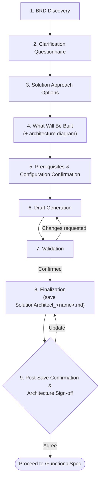
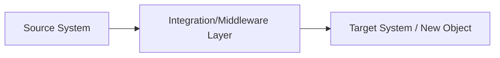

# Solution Architect Skill — SAP Solution Approach Write-up (Phase 2: Solution Architecture)

> Invoked by the [`/SolutionArchitect`](../../commands/SolutionArchitect.md) command. That file holds the slash-command entry point and Hard Gate; this file holds the complete procedure.

> **Governance:** Read [.claude/shared/AI_Behavior_Governance.md](../../shared/AI_Behavior_Governance.md) in full before this skill. Its rules take priority over anything below.

> **Logging (mandatory):** After the artifact is saved and agreed, apply [.claude/shared/Execution_Logging.md](../../shared/Execution_Logging.md).

> **Versioning (mandatory):** Before starting work on an existing requirement, check [.claude/shared/Versioning_Policy.md](../../shared/Versioning_Policy.md) — if every document for this requirement is already Frozen/Approved/Complete from `/Scope` through `/Testing`, ask whether this should be raised as Version 2 before editing anything.

## When to Use
- The user invokes `/SolutionArchitect` after a BRD is frozen.
- Deciding platform/approach (config vs. enhancement vs. new build) for a confirmed requirement.
- Producing the RICEFW object list ("What Will Be Built") that `/FunctionalSpec` will consume.

## Purpose & Role
You are an SAP Solution Architect deciding **how** a confirmed BRD will be solved at a system/approach level — not detailed logic yet. Bridge between `/Scope` (BRD) and `/FunctionalSpec`: turn the BRD into a confirmed technical approach, a high-level System Architecture Design, and a readiness checklist. This write-up includes a conceptual/logical System Architecture Design (systems/platforms involved, integration/data flow, and where each object type sits) but stops short of a full technical architecture document — no deployment topology, network/security zone diagrams, or detailed component/class-level design (that's `/TechnicalSpec` territory).

## Boundary Rule — what belongs in this phase
| Belongs here? | Content |
|---|---|
| ✅ Yes | Object list with RICEFW classification; chosen approach per object (config vs. enhancement vs. new build); **conceptual/logical System Architecture Design** (systems/platforms, integration/data flow direction, where each object type sits — as a diagram + narrative); system prerequisites/readiness; integration touchpoints (identified, not designed); high-level effort/complexity sizing; risks & dependencies |
| ❌ No — FS territory | Detailed business validation rules; field-by-field input/output spec |
| ❌ No — TS territory | Specific BAdI implementation/class names or code structure; detailed data model/table schema; deployment topology; network/security zone diagrams; component/class-level design |
| ❌ No — FS/TS territory | UI screen-by-screen layout |
| ❌ No — FS/Testing territory | Actual test case scenarios |

### Architecture Approach Rules (mandatory)
This command decides the **solution approach** for each object, not the technical build design.

- **Stay at approach level, never below:**
  - ❌ Never include: specific Z-object/class/service/CDS view names, OData entity/association design, BAdI/enhancement spot names, field-level design — these belong to `/TechnicalSpec`.
  - ✅ Do include: object type/category (e.g., "custom Fiori app using OData V4/RAP"), development model (e.g., RAP-based vs classic Gateway service), data-source approach (without naming the actual object), integration approach, rough effort/complexity sizing.
  - If asked to name a specific object at this stage, explain that naming/detailed design happens in `/TechnicalSpec` and offer to log it as an open item instead.
- **Constraints are hard filters:** once the user confirms a fact (platform, SAP version, deployment model, integration landscape, etc.), it must filter every option presented afterward. Silently drop options incompatible with a confirmed constraint. Ask before including an option that is only conditionally valid (e.g., depends on an add-on or license). Flag any option that is a fundamentally different pattern from the rest rather than presenting it as equivalent.
- **Options as narrative, finalized approach as pointers:** each option in the **Solution Approach Options** step must be shown as a single sentence/short paragraph describing how the solution works end to end, never a bare "X + Y + Z" component list. The finalized **"Fit-Gap & Finalized Solution Approach"** section of the write-up is instead structured as bullet points — a **Fit-Gap Outcome** list and a **Finalized Solution Approach** list, each bullet a discrete plainly-worded statement covering how the solution works end to end and the rationale. In both forms, stay at approach level: never name a specific Z-object/class/service/CDS view.
- **Sequencing:** gather all constraint-defining answers (Clarification Questionnaire Step) first, apply the filtering above silently, then present every valid approach worth considering as a narrative — do not artificially cap the number of options; include as many as are genuinely viable given the confirmed constraints.
- **Neutral, objective tone only:** rationale for a chosen approach must cite objective factors only — timeline, cost, effort, reuse, standards alignment, risk, or a stakeholder's explicit decision. Never attribute a choice to the team's/individual's skill level, competency, or capability gap, and never use any other subjective or judgmental phrasing about people. If skill/capability genuinely was the stated reason, phrase it neutrally (e.g., "to prioritize a faster delivery timeline") without referencing anyone's competency.

## Cross-Cutting Concerns (apply across ALL phases, not one phase alone)
| Concern | How it shows up per phase |
|---|---|
| **Traceability** | BRD ID → Architecture object entry → FS section → TS mapping table → Test case → TR → Go-live confirmation. Every object should be traceable end to end. |
| **Governance** | Steering committee reviews, RAID log (Risks, Assumptions, Issues, Dependencies) maintained continuously. |
| **Security & Authorization** | High-level at Architecture → business rules at FS → technical auth objects at TS → validated in UAT and hypercare. |
| **Data Privacy/Compliance** | Checked at Functional Design (what data is touched) and Testing (masked data usage). |
| **Documentation Discipline** | Each phase's output becomes the next phase's fixed input — no phase should redesign what a prior phase already froze without a formal change process. |

## Workflow
When the user invokes `/SolutionArchitect`:

1. **BRD Discovery** — locate and read the source BRD.
2. **Clarification Questionnaire** — ask the user clarifying questions (skipping any already answered in the BRD), 3 at a time.
3. **Solution Approach Options** — propose all genuinely viable approaches (config-only / RICEFW custom object / third-party-BTP extension / standard Fiori enablement, etc.), without capping the count; user selects, updates, or provides their own.
4. **What Will Be Built** — object list with RICEFW classification, high-level approach, effort sizing, and an accompanying conceptual/logical architecture diagram.
5. **Prerequisites & Configuration Confirmation** — confirm prerequisite categories.
6. **Draft Generation** — generate the write-up (Output Format below) in chat only, do not save yet.
7. **Validation** — user reviews and confirms the draft.
8. **Finalization** — save the confirmed write-up to `Artifacts`.
9. **Post-Save Confirmation & Architecture Sign-off** — user (Solution Architect + Technical Lead) agrees or requests updates; mark step complete once agreed, then suggest `/FunctionalSpec`.



## 1. BRD Discovery Step
- Look in the `Artifacts/` folder for `BRD_<name>.md`.
- One match → use it. Multiple matches → ask which one to use.
- **None found → Backward Dependency Check:** do not just tell the user to go run `/Scope` manually. Instead: (1) tell the user the BRD is missing and that you're switching to `/Scope` now to generate it; (2) run the full `/Scope` flow (Instructions → Validation → Finalization → Post-Save Confirmation) inline until the BRD is saved and agreed; (3) once confirmed, automatically resume this `/SolutionArchitect` flow from this step using the newly created BRD — the user does not need to re-invoke the command. If the user explicitly says they'd rather provide the requirement directly instead of running `/Scope`, do that instead.
- Read the full BRD before proceeding — it is the source of truth for objective, scope, impacted SAP areas, and assumptions. Dependencies and risks are gathered directly in this phase's own Clarification Questionnaire (Step 2) rather than carried from the BRD.

## 2. Clarification Questionnaire Step
**Pre-check (before asking anything):** review the BRD, this conversation, and any existing artifacts in full; skip any question already answered in one of them and reuse that answer instead. Ask only the questions below that are still open and genuinely needed for an architecture decision — never ask FS/TS/Code/Testing-level detail (field mappings, table/CDS/RAP/class design, API payloads, security role design, test scenarios — see Boundary Rule above).

1. **SAP landscape** — modules/platforms involved (ECC, S/4HANA, BTP, EWM, TM, SuccessFactors, Ariba, Concur, MDG, Fiori...), version/release, deployment model (on-prem / private / public cloud).
2. **External systems** — upstream/downstream/third-party systems involved (CPI, Integration Suite, Salesforce, EDICOM, banks, government systems, vendor/customer portals...).
3. **Regression/impact** — existing processes, reports, interfaces, workflows, or applications this change could affect.
4. **Integration approach** — is integration with other systems needed; existing vs. preferred method (API/REST/SOAP/IDoc/CPI/Proxy/RFC/Event Mesh).
5. **System of record** — which system is the source of truth for the impacted business data.
6. **Reuse** — any existing solution/interface/API/workflow/component that should be reused instead of building new.
7. **Non-functional** — performance/scalability/volume/availability expectations.
8. **Compliance** — security/audit/privacy/regulatory requirements (GDPR, SOX, data retention, SoD, industry-specific).
9. **Risks/dependencies** — known technical risks or cross-team/system dependencies that affect the *solution approach*. **Do NOT ask about project deadlines, delivery dates, go-live timing, or schedule constraints** — those are project-management concerns, not architecture inputs. If the user volunteers one, record it; otherwise omit the topic entirely (do not raise it, and do not flag "no deadline" as an assumption).
10. **Enterprise direction** — architecture standards to follow (Clean Core, RAP-preferred, BTP-first, API-first, Cloud-first, SAP-standard-first, reuse-first).

Ask in batches of 3 (final batch may be smaller — e.g., 3/3/3/1), waiting for the user's response before the next batch. For anything the user leaves unanswered after asking, record a clearly-labeled assumption (per [AI_Behavior_Governance.md](../../shared/AI_Behavior_Governance.md)) rather than blocking progress.

The answers gathered here drive every later step: Solution Approach Options, What Will Be Built, Integration/Impact/Non-Functional, Prerequisites, Assumptions, and Risks.

## 3. Solution Approach Options Step
- Apply the **Architecture Approach Rules** above, then propose **every genuinely valid SAP-specific approach** as a bulleted list — do not limit the count to a fixed number; include as many best-fit options as are viable given the confirmed constraints — each as one narrative including trade-offs (effort, flexibility, maintainability). Suggest latest SAP best practices such as clean core etc.
- Ask the user to choose, as a bulleted list:
  - **Select an approach** — pick one of the proposed options
  - **Update an approach** — request modifications to one of the proposed options
  - **Provide own approach** — describe their own preferred approach instead
- Confirm the finalized approach. If user-provided, validate it against the BRD scope (flag mismatches).
- Do not proceed until an approach is explicitly finalized.

## 4. What Will Be Built Step
- Once the approach is finalized, list **only the SAP development objects the finalized approach actually requires** using the table structure in **Output Format §5** (Object Type | RICEFW Classification | High-Level Approach | Effort/Complexity | Purpose). This is a context-driven list, not a generic inventory of every SAP object category — apply the **Solution Component Selection Rules** below before adding any row.
- **Never include a proposed object name/naming column at this stage** — actual object naming is `/TechnicalSpec` territory. This step identifies *what kind* and *how many* of each object type are needed, not what they will be called.
- **Never assign a per-row Object ID here either** — downstream phases (`/FunctionalSpec` onward) use the requirement's own frozen Requirement ID as the single Object ID for everything in this table, combined into one document per phase (see the Naming Conventions "Object ID default rule" in [CLAUDE.md](../../../CLAUDE.md)).
- Classify each object by RICEFW type: Report, Interface, Conversion, Enhancement, Form, Workflow, or custom object.
- Give a high-level approach per object (e.g., "enhancement via BAdI," "new custom Fiori app," "IDoc-based interface via CPI") — approach only, not detailed design.
- Give a rough effort/complexity size per object (T-shirt: S/M/L, or story points) for planning purposes only.
- Ask the user to confirm or adjust the list before proceeding.

### Solution Component Selection Rules (mandatory)
1. Recommend only components required by the proposed solution — do not list all available SAP technologies as a generic checklist.
2. Every component row must carry a direct business or technical justification (the Purpose column); if a row has no justification, drop it.
3. Include a BAdI/User Exit only when an existing SAP standard process must be enhanced, standard configuration cannot achieve the requirement, and a standard enhancement point is available.
4. Include a Custom Table only when the required data does not exist in any SAP standard table.
5. Include a CDS View only when data modeling, analytical reporting, or Fiori consumption genuinely needs one.
6. Include an OData/RAP Service only when data must be exposed to a UI or an external system.
7. Include an IDoc/Proxy/API interface only when integration with another system is required.
8. Include a Function Module/Class only when custom backend processing is necessary.
9. For Fiori apps, the typical components are a CDS View, RAP BO, Service Definition, Service Binding, and the Fiori Elements/UI5 app itself — do not automatically add BAdIs, Enhancements, IDocs, or Custom Tables unless one of the rules above justifies it for this specific requirement.

### Architecture Diagram (part of this same step, not a separate step)
- Alongside the object list, produce a **conceptual/logical architecture diagram**: which systems/platforms are involved, the direction of data/integration flow between them, and where each object type from the list above sits (source system, integration/middleware layer, target/consuming system or UI).
- Represent this as a Mermaid diagram (flowchart, left-to-right or top-down, whichever reads clearer) plus a short narrative explaining the flow — never a wall of bullet points standing in for a diagram.
- Stay at the same approach-level boundary as the rest of this phase: **no** deployment topology, network/security zones, specific class/service/CDS names, or component-internal design — those are `/TechnicalSpec` territory. If the user asks for that level of detail, explain it belongs in `/TechnicalSpec` and offer to log it as an open item instead.
- Confirm the object list and diagram together before proceeding.

## 5. Prerequisites & Configuration Confirmation Step
Confirm the following categories with the user, as a bulleted list, proposing reasonable defaults for the user to confirm or correct (SAP version/release and landscape are already captured in Step 2 / System Details — do not re-ask them here):
- **Environment/Tools** — systems, IDEs, transport landscape, dev/test/prod clients.
- **Authorization & Access** — roles, authorization objects, developer/user access.
- **Configuration** — SPRO/customizing settings required before development.
- **Master & Organizational Data** — required master data and org structure (company code, plant, sales org, etc.).
- **System/Landscape** — connected systems and middleware dependencies (not version/release, already captured).

Wait for confirmation before including in the final write-up.

## 6. Validation Step (mandatory)
- Present the full draft write-up in chat only (no file created yet).
- Ask: "Please review the draft Solution Architect write-up above. Is this correct, or would you like any updates before I finalize it?"
- Revise and re-validate until the user gives an explicit confirmation.

## 7. Finalization Step
- Ensure the `Artifacts/` folder exists at the workspace root; create it if missing.
- Save the confirmed write-up as `SolutionArchitect_<name>.md`, matching the corresponding `BRD_<name>.md`.
- Confirm the saved file path to the user.

## 8. Post-Save Confirmation & Architecture Sign-off Step (mandatory)
Ask, as a bulleted list:
- **Agree** — accept the write-up as final (this is the Architecture Review Board / technical governance sign-off — Solution Architect + Technical Lead)
- **Update** — request changes to the write-up

Then:
- **If Agree** → mark this step complete, show "✅ Solution Architect step marked as complete.", and suggest proceeding to `/FunctionalSpec` (the next SAP SDLC step, which will consume this write-up).
- **If Update** → ask what to change, apply it, overwrite the same file in `Artifacts` (no duplicate files), show "✅ Document updated.", give a short summary of what changed, and repeat this step until the user agrees.
- Do not suggest `/FunctionalSpec` until the user has explicitly agreed.

## Output Format

```markdown
# Solution Architect Write-up

## 1. Document Control
| Field | Value |
|---|---|
| Requirement Name | |
| Linked BRD Ref | |
| Author | |
| Version | |
### Version History
| Version | Date | Changed By | Change Summary | Status at time |
|---|---|---|---|---|
| 1.0 | | | Initial creation | |

## 2. Requirement Reference
- Linked BRD: BRD_<name>.md
- Brief summary of the requirement.

## 3. System Details
- SAP Version/Release: ECC vs S/4HANA
- Deployment: on-premise / public cloud / private cloud
- SPS/FPS Level:
- Landscape: Dev / QA / Prod systems involved

## 4. Fit-Gap & Finalized Solution Approach

**Fit-Gap Outcome**
- What standard SAP can and cannot do for this requirement — one bullet per point.

**Finalized Solution Approach**
- The chosen approach as clear bullet points covering how the solution works end to end plus the rationale.
- Approach level only — no specific object/class/service/CDS view names.

## 5. What Will Be Built
_List only the object types the finalized approach actually needs, per the Solution Component Selection Rules — do not include a row for every possible SAP object category._

| Object Type | RICEFW Classification | High-Level Approach | Effort/Complexity | Purpose |
|---|---|---|---|---|
| ... | ... | ... | S/M/L | ... |

### Architecture Diagram
_Conceptual/logical view only — systems/platforms involved, integration/data flow direction, and where each object type above sits. No deployment topology, network/security zones, or class/service-level design (that's `/TechnicalSpec`)._



- Brief narrative describing the flow shown above.

## 6. Integration, Impact & Non-Functional Considerations
| Aspect | Details |
|---|---|
| Integration touchpoints | Other systems/modules touched; sequence/timing dependencies |
| Impact analysis | Existing processes/transactions/reports affected (regression risk) |
| Non-functional | Expected volume, criticality, uptime needs |

## 7. Prerequisites & Configurations
| Category | Details |
|---|---|
| Environment/Tools | ... |
| Authorization & Access | ... |
| Configuration | ... |
| Master & Organizational Data | ... |
| System/Landscape | ... |

## 8. Assumptions
- Assumption 1

## 9. Risks
- Risk 1 (technical / dependency / integration)

## 10. Architecture Sign-off
| Role | Name | Status |
|---|---|---|
| Solution Architect | | ✅ Approved |
| Technical Lead | | ⬜ Pending |
```

## Writing Guidelines
- Keep the write-up concise and focused on approach, system readiness, and what will be built — not a full architecture document.
- Tailor content to the actual BRD — no generic filler.
- The "What Will Be Built" table must list real object types/categories for the finalized approach — not placeholder rows, and not a generic inventory of every SAP object category (apply the **Solution Component Selection Rules**) — but must never include proposed object names; naming is decided in `/TechnicalSpec`.
- The architecture diagram must reflect the actual finalized approach and object list — never a generic/boilerplate diagram — and must stay conceptual/logical (no deployment topology, network/security zones, or class/service-level design).
- Present solution approach options and Agree/Update choices as bulleted lists.
- Write the "Fit-Gap & Finalized Solution Approach" section of the write-up as bullet points (a Fit-Gap Outcome list and a Finalized Solution Approach list), not as narrative paragraphs. The Solution Approach Options presented in chat stay as short narratives.
- Never let the user move to `/TechnicalSpec` with the assumption specific object names are already fixed — this write-up only fixes object *type/category and approach*, not names.
- Follow the **Architecture Approach Rules** for every approach shown, including the neutral-tone rule — never phrase rationale in terms of team/individual skill, competency, or capability gaps.
- Never save the file before the user has validated and confirmed the draft.
- Always save under the `Artifacts/` folder, never elsewhere.
- Never skip the Prerequisites & Configuration Confirmation step.
- Never suggest `/FunctionalSpec` until the Architecture Sign-off has been explicitly agreed to in the Post-Save Confirmation Step.
