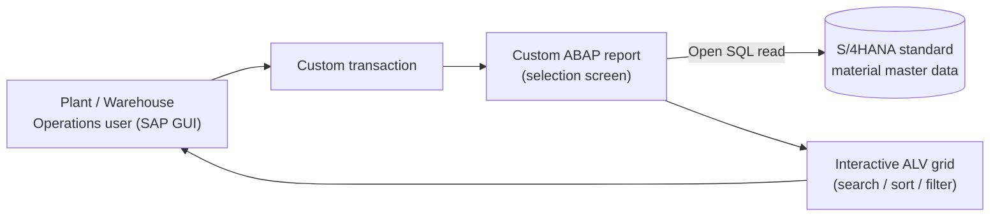

# Solution Architect Write-up

## 1. Document Control
| Field | Value |
|---|---|
| Requirement Name | Material Summary Application (MM-RPT-001) |
| Linked BRD Ref | [BRD_MaterialSummaryReport.md](BRD_MaterialSummaryReport.md) |
| Author | shilpiverma.iin@gmail.com (Architect profile, AI-assisted) |
| Version | 1.0 |
### Version History
| Version | Date | Changed By | Change Summary | Status at time |
|---|---|---|---|---|
| 1.0 | 2026-09-23 | shilpiverma.iin@gmail.com | Initial creation | Draft |
| 1.0 | 2026-09-23 | shilpiverma.iin@gmail.com | Architecture sign-off (Solution Architect + Technical Lead) | Approved |

## 2. Requirement Reference
- Linked BRD: [BRD_MaterialSummaryReport.md](BRD_MaterialSummaryReport.md)
- Interactive, searchable view of material master attributes (material type, material group, description, base unit of measure, status) across all plants and material types, for Plant/Warehouse Operations users — view and search/filter only, no export.

## 3. System Details
- SAP Version/Release: S/4HANA
- Deployment: On-premise
- SPS/FPS Level: 🔸 Not specified — assumed not a blocking factor for this decision
- Landscape: Standard Dev / QA / Prod

## 4. Fit-Gap & Finalized Solution Approach

**Fit-Gap Outcome**
- Standard SAP holds all required material attributes, but offers no single interactive screen presenting this profile across all plants — users currently piece it together from multiple transactions.
- Standard-only alternatives were not evaluated further — a custom build was an explicit stakeholder decision.
- No integration, conversion, form, or workflow gap exists — the gap is a single reporting object.

**Finalized Solution Approach**
- New custom classic ABAP executable report, launched from its own custom transaction in SAP GUI.
- Selection screen lets users optionally restrict by material attributes; unrestricted by default so all plants and material types are covered.
- Data read directly from standard material master data via Open SQL — no custom tables, no data persisted.
- Output shown in an interactive ALV grid — standard ALV sort, filter, search, and column-layout functions provide the searchable, self-service view.
- Access controlled by standard transaction-start authorization only — no plant or material-type restriction.
- Rationale: aligns with the confirmed classic ABAP-first enterprise standard, lowest effort (S), low maintenance footprint, and volume (< 50k materials) does not justify database push-down techniques.

## 5. What Will Be Built
| Object Type | RICEFW Classification | High-Level Approach | Effort/Complexity | Purpose |
|---|---|---|---|---|
| Custom ABAP executable report | Report | New classic ABAP program: selection screen, Open SQL read of material master, interactive ALV grid output | S | Delivers the single searchable material summary view required by the BRD |
| Custom transaction code | Report (entry point) | New report transaction assigned to the program | S | Direct user entry point; controls access via standard transaction authorization |

### Architecture Diagram

- The user starts the custom transaction in SAP GUI, optionally narrows the selection, and the report reads standard material master data inside the same S/4HANA system, presenting it in an interactive ALV grid. Everything stays within one system; no data leaves SAP.

## 6. Integration, Impact & Non-Functional Considerations
| Aspect | Details |
|---|---|
| Integration touchpoints | None — SAP only (confirmed) |
| Impact analysis | Read-only new object; no existing processes, transactions, or reports are changed — no regression risk to standard |
| Non-functional | < 50k materials; interactive response expected, no hard SLA; low criticality (convenience/efficiency tool) |

## 7. Prerequisites & Configurations
| Category | Details |
|---|---|
| Environment/Tools | S/4HANA DEV/QA/PRD with standard transport route; ADT (Eclipse) or SE80 for development |
| Authorization & Access | Developer authorization in DEV; Security team adds the new transaction to the Plant/Warehouse Operations business role (PFCG) |
| Configuration | None required |
| Master & Organizational Data | Material master maintained across plants; representative test materials available in DEV/QA |
| System/Landscape | No connected systems or middleware |

## 8. Assumptions
- 🔸 SPS/FPS level does not constrain a classic ABAP ALV report.
- Transaction-level authorization only (confirmed).
- Custom build (confirmed); standard-only alternatives not evaluated.

## 9. Risks
- **Export vs. scope:** standard ALV includes spreadsheet/local-file export by default, while the BRD rules export out of scope — `/FunctionalSpec`/`/TechnicalSpec` must decide whether to suppress it.
- **"Status" ambiguity:** material master has both a cross-plant and a plant-specific status — `/FunctionalSpec` must confirm which to show.
- **Row volume:** "all plants" can mean one row per material per plant, exceeding the 50k material count — paging/default selection limits are a `/TechnicalSpec` concern.
- **Direct table reads:** reading tables rather than released interfaces follows the classic ABAP-first standard; recorded as a Clean Core deviation.

## 10. Architecture Sign-off
| Role | Name | Status |
|---|---|---|
| Solution Architect | shilpiverma.iin@gmail.com | ✅ Approved |
| Technical Lead | shilpiverma.iin@gmail.com | ✅ Approved |
