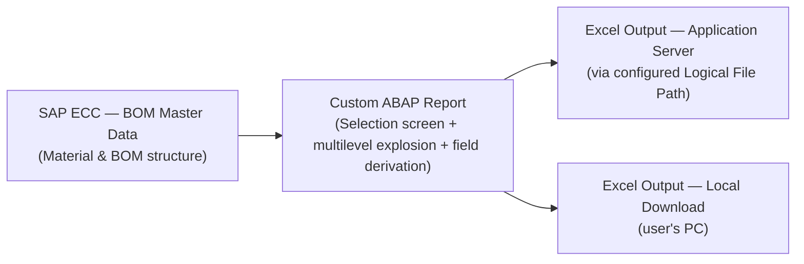

# Solution Architect Write-up

## 1. Document Control
| Field | Value |
|---|---|
| Requirement Name | Multilevel BOM Excel Export Report |
| Linked BRD Ref | BRD_MultilevelBOMExcelExport.md |
| Author | SAP-SDLC (AI-assisted, Technical Consultant/Developer profile) |
| Version | 1.0 |

### Version History
| Version | Date | Changed By | Change Summary | Status at time |
|---|---|---|---|---|
| 1.0 | 2026-09-17 | shilpiverma.iin@gmail.com | Initial creation | Draft |

## 2. Requirement Reference
- Linked BRD: [BRD_MultilevelBOMExcelExport.md](BRD_MultilevelBOMExcelExport.md)
- New custom report to export a fully exploded multilevel BOM structure (header + component data) to Excel, for materials/plant/validity-date selected by the user, with a choice of output destination (application server or local download), and each Level 0 material's structure kept in its own dedicated output section.

## 3. System Details
- SAP Version/Release: ECC (SAP ERP 6.0)
- Deployment: On-premise
- SPS/FPS Level: 🔸 Not specified — assumed not a blocking factor for this decision
- Landscape: Standard Dev / QA / Prod systems

## 4. Fit-Gap & Finalized Solution Approach

**Fit-Gap Outcome**
- Standard SAP supports on-screen multilevel BOM explosion, but has no built-in capability to export a fully exploded multilevel BOM structure to Excel in one step.
- Standard SAP BOM explosion logic can be reused to perform the recursive explosion — the explosion logic itself does not need to be rebuilt from scratch.
- SAP Query/InfoSet tooling cannot support the required custom field derivation, multi-step classification logic, or recursive explosion, so it was ruled out.
- No standard Fiori/BTP capability addresses this need, and introducing one would be a platform pattern misaligned with the confirmed ECC on-premise, classic-ABAP-first landscape.
- Gap requiring custom build: the dual output-destination handling (application server vs. local, with a consistent file-naming convention) and the custom field derivation/output structure.

**Finalized Solution Approach**
- Build one new custom ABAP executable report, accessible via its own transaction code, presenting a selection screen for material(s), plant, and BOM validity date.
- Reuse SAP's standard BOM explosion capability to recursively explode the BOM from each selected material (Level 0) down through all existing subordinate levels.
- Apply the confirmed field derivation and classification rules to build the output dataset (header and component-level information).
- Structure the output so each Level 0 material's fully exploded BOM occupies its own dedicated section — no mixing of components across different Level 0 materials.
- Provide the confirmed dual output-destination choice — application server (via a newly configured logical file path) or local file download — both using the same automatic file-naming convention.
- No external system integration is included in this scope; Teamcenter is not an active integration point for this build.
- This approach follows the pattern already established in the reference document, minimizing design risk and aligning with the confirmed enterprise direction.

## 5. What Will Be Built

| Object Type | RICEFW Classification | High-Level Approach | Effort/Complexity | Purpose |
|---|---|---|---|---|
| Custom Report (with its own Transaction Code) | Report (R) | New classic ABAP executable report with a selection screen (material, plant, validity date, output destination); invokes SAP's standard BOM explosion capability recursively per selected material, applies the required field derivation and classification rules, and writes the result to an Excel-formatted file | L | Core deliverable — the multilevel BOM Excel export capability |

### Architecture Diagram

- The report reads BOM master data directly from the SAP ECC system, performs the multilevel explosion and all field derivation/classification logic in one custom program, and writes the resulting Excel file to whichever destination the user selected on the selection screen. No other systems or middleware are involved.

## 6. Integration, Impact & Non-Functional Considerations
| Aspect | Details |
|---|---|
| Integration touchpoints | None — no external system integration in this scope; output is a standalone Excel file |
| Impact analysis | No known impact on existing processes/transactions/reports — net-new, standalone report (confirmed) |
| Non-functional | Standard/moderate volumes expected; no special performance/scalability design required beyond following standard practice for BOM explosion |

## 7. Prerequisites & Configurations
| Category | Details |
|---|---|
| Environment/Tools | Standard ABAP Workbench development (SE38/SE80); standard transport route across existing Dev → QA → Prod clients |
| Authorization & Access | Standard SAP authorization only — new/extended authorization object check tied to the new transaction code; developer access to create Z-objects in Dev |
| Configuration | New Logical File Path/Logical File Name definition (SPRO), pointing to the physical application-server directory |
| Master & Organizational Data | Relevant plants and material/BOM master data must already exist in the target client for build/unit testing |
| System/Landscape | Single ECC system landscape; no additional middleware required |

## 8. Assumptions
- 🔸 SPS/FPS level not specified — assumed not a blocking factor for this development.
- 🔸 Org/plant scope remains runtime-selectable (per BRD); no fixed single-plant restriction assumed at architecture level.
- 🔸 Standard SAP authorization framework is assumed sufficient — no custom authorization object beyond the standard transaction-code-level check, unless Functional Spec surfaces a more granular need.
- 🔸 On-demand execution only (per BRD) — no background job/scheduling variant included in this scope.

## 9. Risks
- Logical File Path/physical directory setup on the application server is a Basis-team dependency and must be completed before the application-server output option can be built/tested.
- Certain output field classification/mapping rules are still pending final confirmation by the business (per BRD) — could affect Functional Spec-level business rule definition if not resolved before that phase.

## 10. Architecture Sign-off
| Role | Name | Status |
|---|---|---|
| Solution Architect | 🔸 Pending confirmation | ✅ Approved |
| Technical Lead | 🔸 Pending confirmation | ⬜ Pending |
