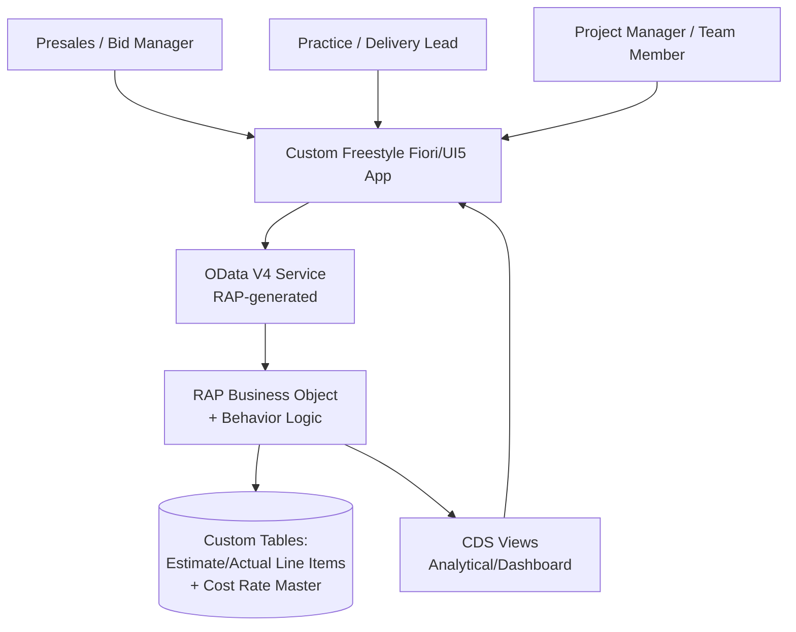

# Solution Architect Write-up

## 1. Document Control
| Field | Value |
|---|---|
| Requirement Name | Project & RFP Effort Management (Fiori App) |
| Linked BRD Ref | BRD_ProjectRFPEffortManagement.md |
| Author | ankur.gupta04@nagarro.com |
| Version | 1.1 |

### Version History
| Version | Date | Changed By | Change Summary | Status at time |
|---|---|---|---|---|
| 1.0 | 2026-09-17 | ankur.gupta04@nagarro.com | Initial creation | Approved |
| 1.1 | 2026-09-17 | ankur.gupta04@nagarro.com | Removed the module-lead approval status from the RAP Business Object's behavior logic (decided during `/FunctionalSpec`, propagated back per the BRD change) — estimates are now review-only, no blocking approval gate. No `/Code` or `/Testing` artifacts existed yet, so no rebuild/re-test/back-out impact. | Approved |

## 2. Requirement Reference
- Linked BRD: [BRD_ProjectRFPEffortManagement.md](BRD_ProjectRFPEffortManagement.md)
- A custom SAP Fiori application to estimate effort and cost for RFPs/proposals — broken down by SAP Activate phase and by SAP functional module — and to track actual effort and cost against those estimates once a project is won and running, replacing today's manual, spreadsheet-based process.

## 3. System Details
- SAP Version/Release: S/4HANA Private Cloud/On-Prem
- Deployment: Private Cloud / on-premise
- SPS/FPS Level: ⚠️ Assumed — not specified by user; assume current supported release for the landscape, to be confirmed with the Basis team
- Landscape: Dev / QA / Prod (standard 3-system transport landscape assumed)

## 4. Fit-Gap & Finalized Solution Approach

**Fit-Gap Outcome**
- Standard SAP has no existing object, report, or app for RFP effort-and-cost estimation broken down by SAP Activate phase and module — this is a net-new business capability, not a configuration gap.
- Standard SAP CATS/Project System can track actual time against WBS elements, but the confirmed system of record for this app's effort/cost data is the new custom app itself, not PS/CATS — so no standard fit exists for this specific need either.
- Conclusion: full custom build required (RICEFW: Custom Object / new development), not a config or enhancement of an existing standard object.

**Finalized Solution Approach**
- Build a new custom data model natively on the S/4HANA ABAP stack (Private Cloud/On-Prem) using the RAP (RESTful ABAP Programming Model), keeping the solution Clean Core-aligned — no core modifications, upgrade-stable extensibility.
- Expose the data model via a RAP-generated OData V4 service for estimate creation/approval and actuals tracking.
- Build the user-facing application as a custom freestyle SAPUI5 app (not Fiori Elements templates), consuming the OData V4 service, giving full UI flexibility for the phase × module effort/cost breakdown grids and dashboards.
- Cost is auto-calculated from logged/estimated effort using a maintained Cost Rate Master (e.g., rate per role/module), with manual override allowed per line for cases where the standard rate doesn't apply.
- Standard SAP authorization concept (PFCG roles/auth objects) governs access — no restricted-visibility requirement beyond standard was identified.
- No integration with external or other SAP systems is required at this time — the app is self-contained with its own custom persistence as system of record.
- Rationale: aligns with SAP's Clean Core direction for a Private Cloud/on-prem landscape, keeps development on-stack (no added BTP subscription/runtime to manage), and a freestyle UI5 app provides the flexibility a standard Fiori Elements list-report/object-page pattern would constrain for this multi-dimensional (phase × module, estimate vs. actual, effort + cost) data entry and dashboard experience.

## 5. What Will Be Built

| Object Type | RICEFW Classification | High-Level Approach | Effort/Complexity | Purpose |
|---|---|---|---|---|
| Custom Table — Estimate/Actual Line Items | Custom Object | New development | S | Persist RFP effort/cost estimates and actual effort/cost, per module and per SAP Activate phase |
| Custom Table — Cost Rate Master | Custom Object | New development | S | Reference rates (e.g., per role/module) used to auto-calculate cost from effort |
| CDS Views (interface + analytical) | Custom Object | New development | M | Data model for the RAP Business Object and aggregated data for the effort/cost-vs-plan dashboard |
| RAP Business Object (with behavior logic) | Custom Object | New development | M | Core transactional logic: estimate CRUD, cost auto-calc/override, actual-vs-estimate computation |
| Service Definition + OData V4 Service Binding | Custom Object | New development (RAP-generated) | S | Exposes the RAP Business Object to the UI as an OData V4 API |
| Custom Freestyle Fiori (SAPUI5) App | Custom Object | New development (freestyle UI5, not Fiori Elements) | L | End-user application: RFP estimate entry, module-lead approval, actuals tracking, dashboards |

### Architecture Diagram

All user roles interact through the same freestyle Fiori/UI5 app, which calls a single OData V4 service generated from a RAP Business Object. The RAP behavior logic handles estimate CRUD and cost calculation (rate master lookup with manual override), persisting to new custom tables on the S/4HANA system itself. CDS analytical views aggregate that data to power the effort/cost-vs-plan dashboard, consumed back in the same app. Everything stays on-stack — no external system or BTP dependency.

## 6. Integration, Impact & Non-Functional Considerations
| Aspect | Details |
|---|---|
| Integration touchpoints | None — self-contained app; no external or other SAP system integration required at this time |
| Impact analysis | No known impact on existing processes, transactions, reports, or workflows |
| Non-functional | Moderate volume (hundreds of RFPs/projects, org-wide user base); standard business-hours availability expected |

## 7. Prerequisites & Configurations
| Category | Details |
|---|---|
| Environment/Tools | ABAP Development Tools (Eclipse) for RAP/CDS development; standard 3-system transport landscape (Dev/QA/Prod); SAP Business Application Studio (or equivalent) for the freestyle SAPUI5 app; Fiori Launchpad tile/target mapping configuration |
| Authorization & Access | New PFCG roles: Presales/Bid Manager, Practice/Delivery Lead, Project Manager, Project Team Member; standard SAP authorization concept only; developer access in Dev system for RAP BO/CDS/OData service creation |
| Configuration | None expected — fully custom object set, not a configuration of an existing standard process |
| Master & Organizational Data | No dependency on existing SAP org data (company code, plant, sales org); Cost Rate Master data to be initially loaded/maintained within the new app (no existing source to migrate from) |
| System/Landscape | S/4HANA Private Cloud/On-Prem; no connected external systems; no middleware dependency |

## 8. Assumptions
- SAP release/SPS level not specified — assumed current supported release for the Private Cloud/on-prem landscape; to be confirmed with the Basis team.
- Standard 3-system transport landscape (Dev/QA/Prod) assumed.
- Cost Rate Master data will need an initial load; no existing source system identified for migration.
- No restricted-visibility requirement for cost data beyond standard SAP authorization.

## 9. Risks
- Data governance risk: the Cost Rate Master must be kept current/accurate for auto-calculated cost figures to remain reliable — no formal ownership/maintenance process identified yet.

## 10. Architecture Sign-off
| Role | Name | Status |
|---|---|---|
| Solution Architect | ankur.gupta04@nagarro.com | ✅ Approved |
| Technical Lead | | ⬜ Pending |
