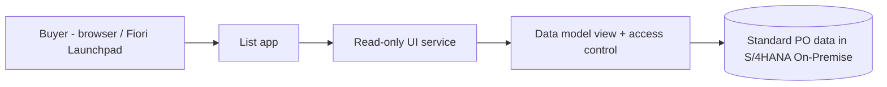

# Solution Architect Write-up

## 1. Document Control
| Field | Value |
|---|---|
| Requirement Name | Recently Created Purchase Orders View |
| Linked BRD Ref | [BRD_RecentPurchaseOrders.md](BRD_RecentPurchaseOrders.md) |
| Author | Not provided |
| Version | 1.0 |

### Version History
| Version | Date | Changed By | Change Summary | Status at time |
|---|---|---|---|---|
| 1.0 | 2026-10-01 | Not provided | Initial creation | Frozen |

## 2. Requirement Reference
- Linked BRD: `BRD_RecentPurchaseOrders.md` (Requirement ID MM-RPT-001)
- Procurement buyers need one application that shows POs created in SAP in the last 30 days, one line per PO, across all company codes and plants they are authorised for.

## 3. System Details
- SAP Version/Release: S/4HANA (release not provided ⚠️)
- Deployment: On-Premise
- SPS/FPS Level: Not provided ⚠️
- Landscape: Existing Dev / QA / Prod systems; the single S/4HANA system is the only system involved

## 4. Fit-Gap & Finalized Solution Approach

**Fit-Gap Outcome**
- SAP standard holds all PO header data needed, so no new data storage is required.
- SAP delivers a standard PO list, but its fixed columns and layout would not guarantee the BRD's one-line-per-PO view with a default last-30-days window.
- No standard configuration alone delivers that exact view, so a small custom read-only app is the gap to fill.
- No integration, workflow or write capability is needed.

**Finalized Solution Approach**
- A custom Fiori Elements list app, built on the modern ABAP programming model and released SAP views, shows POs created in the last 30 days, one line per PO.
- A read-only data model reads standard PO header data, and access control limits rows to what each user is authorised to see.
- The 30-day window is applied by default when the app opens.
- Rationale: SAP standard first and Clean Core. The approach uses released SAP interfaces only, makes no change to SAP core, and gives the exact layout the BRD asks for.
- Standard-list-only and classic-report alternatives were considered and not selected, because the list would not fit the exact layout and the report is less aligned with Clean Core.

## 5. What Will Be Built
| Object Type | RICEFW Classification | High-Level Approach | Effort/Complexity | Purpose |
|---|---|---|---|---|
| Data model view | Report | Read-only view over released PO header data, one row per PO, filtered by creation date | S | Supplies the one-line-per-PO data |
| Data access control | Report (security) | Restricts rows to authorised company codes/plants | S | Meets the authorised-data-only assumption |
| Service for UI | Report | Read-only OData V4 service exposing the view | S | Lets the app read the data |
| List app | Report | Fiori Elements list report with default last-30-days filter | S | The application buyers use |

### Architecture Diagram

- The buyer opens the app from the launchpad. The app calls a read-only service, which reads the data model view over standard PO data, with access control applied. Everything runs inside one S/4HANA On-Premise system, with no external systems.

## 6. Integration, Impact & Non-Functional Considerations
| Aspect | Details |
|---|---|
| Integration touchpoints | None. Single SAP system, no interfaces. |
| Impact analysis | Read-only. No existing PO process, report or interface is changed. |
| Non-functional | ⚠️ Assumed: a 30-day PO window is a modest volume, and the view loads within normal interactive response times. Actual PO volumes were not provided. |

## 7. Prerequisites & Configurations
| Category | Details |
|---|---|
| Environment/Tools | Existing Dev/QA/Prod with standard transports; development via ABAP Development Tools |
| Authorization & Access | Buyers: app access and PO display authorisation. Developers: development authorisation (⚠️ connector access currently returns 401/403 and needs checking) |
| Configuration | Fiori Launchpad and Gateway service activated; catalog and tile for the app |
| Master & Organizational Data | Existing purchasing org / company code / plant structure and existing POs; no new master data |
| System/Landscape | Single S/4HANA On-Premise system with Fiori frontend access (⚠️ release/SPS not provided) |

## 8. Assumptions
- ⚠️ The platform is S/4HANA On-Premise as stated, but the release and SPS level are unknown.
- ⚠️ No external systems or integration are needed. The BRD describes a single SAP system.
- ⚠️ SAP is the only system of record for PO data.
- ⚠️ Fiori Launchpad and Gateway are already available. This was not confirmed.
- ⚠️ The BRD's "last 30 days" rolling window and the one-line-per-PO field set carry over unchanged.
- ⚠️ No special compliance beyond standard SAP authorisation was stated. None is assumed.

## 9. Risks
- **Technical:** Fiori or Gateway may not be active on the system, which would need setup before the app can be used.
- **Technical:** An older release may lack some released views the approach relies on, which could force a design change in `/TechnicalSpec`.
- **Security:** Without correct access control, buyers could see POs for company codes or plants they should not.
- **Dependency:** Developer access to the system is currently unverified (authorisation errors from the connector).

## 10. Dependencies
- SAP Basis team: Fiori Launchpad and Gateway activation.
- Security team: roles for app and PO display access.
- Procurement team: confirmation of the fields shown per PO, for `/FunctionalSpec`.

## 11. Recommendations
- **Preferred:** Option B, the custom Fiori list app, for the exact one-line-per-PO layout, Clean Core alignment and low maintenance.
- **Alternative:** Option A, the SAP standard PO list with a saved 30-day filter. This is cheaper and needs no build, so it is worth revisiting if the standard columns turn out to be acceptable.
- **Pros of B:** exact layout, upgrade-safe, extendable later.
- **Cons of B:** a small build effort and a dependency on Fiori setup.

## 12. Architecture Sign-off
| Role | Name | Status |
|---|---|---|
| Solution Architect | | ⬜ Pending |
| Technical Lead | | ⬜ Pending |
