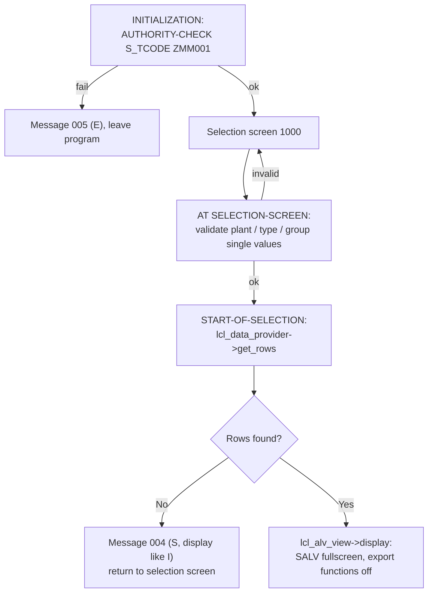

# Technical Specification

## 1. Document Control
| Field | Value |
|---|---|
| Object ID | MM-RPT-001 |
| Object Name (Technical) | ZMM_MAT_SUMMARY |
| RICEFW Type | Report |
| Linked Functional Spec Ref | [FunctionalSpec_MM-RPT-001.md](FunctionalSpec_MM-RPT-001.md) |
| Linked Solution Architect Ref | [SolutionArchitect_MaterialSummaryReport.md](SolutionArchitect_MaterialSummaryReport.md) |
| Author | SAP-SDLC (AI-assisted) for shilpiverma.iin@gmail.com |
| Version | 1.0 |
### Version History
| Version | Date | Changed By | Change Summary | Status at time |
|---|---|---|---|---|
| 1.0 | 2026-09-23 | shilpiverma.iin@gmail.com | Initial creation | Draft |
| 1.0 | 2026-09-23 | shilpiverma.iin@gmail.com | Frozen after freeze confirmation | Frozen |

## 2. Development Object Overview
- Object type: custom classic ABAP executable report (local classes) with its own report transaction
- Naming convention: `config/naming-standards.json` — Module `MM`, Purpose `MAT_SUMMARY`, Area `MATSUM`, transaction number `001` from the Requirement ID
- Package: `ZMM_MATSUM`
- Transport: one Workbench request, description containing "MM-RPT-001"; no Customizing request (FS: no configuration)

## 2a. Reuse Assessment (Revisited)
| Check | AI Finding | User Response | Status | Notes |
|---|---|---|---|---|
| Another FS/TS for 1SAP with predominantly the same functionality? (all WRICEF inventories considered) | No other FS/TS in `Artifacts/` overlaps | Agree — no overlap | ✅ Accepted | Sole material-summary requirement |
| WRICEF previously developed in another system? | None known | No, not built elsewhere | ✅ Accepted | New build |

## 2b. Clean Core Assessment (Mandatory)
| Check | AI Finding | User Response | Status | Notes |
|---|---|---|---|---|
| Prefer released APIs, RAP, CDS, ABAP Cloud over classic techniques? | Classic ABAP report with Open SQL on MARA/MARC/MAKT and SALV, per the finalized approach | N/A — approach fixed in Solution Architect write-up | Accepted (inherited) | `SolutionArchitect_MaterialSummaryReport.md` §4 (classic ABAP-first standard) and §9 (Clean Core deviation risk) |
| Any direct modification of an SAP standard object? (must be avoided) | None — read-only access to standard tables; standard SALV used as-is | Agree — no modifications | ✅ Accepted | — |
| Any unreleased/non-strategic API used? (must be avoided, or justified if unavoidable) | Direct reads of MARA/MARC/MAKT/T001W/T134/T023 instead of released CDS views, inherent to the classic approach | N/A — approach fixed in Solution Architect write-up | Accepted (inherited) | Same SA reference |

> **User Response** legend: ✅ Accepted / ❌ Rejected / ⚪ No response — assumed OK by user / `N/A — approach fixed in Solution Architect write-up`.

## 2c. Object Inventory & Impacted Components
| Object Name | Type | New or Impacted (Existing) | Description |
|---|---|---|---|
| ZMM_MATSUM | Development Package | New | Container for all objects below |
| ZMM_MAT_SUMMARY | Program (executable report) | New | Selection screen, validation, data read, SALV output, local classes + unit tests |
| ZMM001 | Transaction Code (report transaction) | New | Starts ZMM_MAT_SUMMARY (selection screen 1000) |
| ZMM_MAT_SUMMARY | Message Class | New | Messages 001–005 (Section 9) |

## 3. Build Approach
- Build approach selected: **Custom Program** (classic ABAP executable report).
- Justification: fixed in the Solution Architect write-up (classic ABAP-first, SAP GUI, ALV); Clean Core deviation inherited (Section 2b).
- UI style: standard selection screen (SELECT-OPTIONS with standard search helps from DDIC references, standard variant handling) and standard SALV fullscreen grid toolbar — SAP standard UI conventions.

## 4. Data Model
No new DDIC objects. The output row type is a program-local type built from standard DDIC field references (so SALV derives column headings and search helps automatically):

| Object | Type | Fields | Key Fields |
|---|---|---|---|
| `ty_output` (local type in ZMM_MAT_SUMMARY) | Local structure | matnr TYPE mara-matnr, maktx TYPE makt-maktx, werks TYPE marc-werks, mtart TYPE mara-mtart, matkl TYPE mara-matkl, meins TYPE mara-meins, mstae TYPE mara-mstae, mmsta TYPE marc-mmsta | None (output only) |
| `tt_output` | Local table type | STANDARD TABLE OF ty_output WITH EMPTY KEY | N/A |

## 4a. Program Definition(s)
| Field | Program 1 (ZMM_MAT_SUMMARY) |
|---|---|
| Common or New Program? | New |
| Application | MM (Materials Management) |
| Development Class | ZMM_MATSUM |
| Authorization Group | None (FS §9 — transaction-level access only) |
| SAP Transaction(s) | ZMM001 (new); reference MM03 |
| Program Description | Interactive, display-only list of material × plant master attributes (description, type, group, base UoM, cross-plant and plant-specific status) with optional selection ranges, deletion-flag filter, and a SALV grid with export functions disabled |
| Input/Output Files | None |
| Program Flow | Section 5 |

## 5. Program / Processing Logic Design

**Local class design**
| Class | Responsibility | Key method(s) |
|---|---|---|
| `lcl_selection_validator` | FS Rule 7 checks against T001W / T134 / T023 | `validate( ir_werks ir_mtart ir_matkl )` raising message 001/002/003 |
| `lcl_data_provider` | Single Open SQL read (Rules 1–6) | `get_rows( ir_matnr ir_werks ir_mtart ir_matkl ir_mstae ir_mmsta iv_incl_deleted ) RETURNING rt_output` |
| `lcl_alv_view` | SALV creation, function suppression, sort, layout (Rule 8, FS §7) | `display( ct_output )` |
| `ltc_mat_summary` (FOR TESTING) | Unit tests (Section 12) with ABAP SQL Test Double framework | see Section 12 |

**FS Rule → Technical Implementation Mapping**
| FS Rule Ref | Business Rule (from FS) | Technical Implementation |
|---|---|---|
| Rule 1 | One row per material × plant | `FROM mara INNER JOIN marc ON marc~matnr = mara~matnr` — one result row per MARC record |
| Rule 2 | Only materials extended to a plant | Consequence of the INNER JOIN to MARC |
| Rule 3 | Apply selection ranges | `WHERE mara~matnr IN @ir_matnr AND marc~werks IN @ir_werks AND mara~mtart IN @ir_mtart AND mara~matkl IN @ir_matkl AND mara~mstae IN @ir_mstae AND marc~mmsta IN @ir_mmsta` (empty range = all) |
| Rule 4 | Exclude deletion-flagged (client OR plant) unless checkbox | When `iv_incl_deleted = abap_false`: `AND mara~lvorm = @space AND marc~lvorm = @space` (dynamic-free: implemented as two static SELECT branches or a range `lr_lvorm` = `I EQ space` vs empty range applied to both fields) |
| Rule 5 | Description in logon language; blank if missing | `LEFT OUTER JOIN makt ON makt~matnr = mara~matnr AND makt~spras = @sy-langu` |
| Rule 6 | Both statuses side by side | Select `mara~mstae` and `marc~mmsta` into the output row |
| Rule 7 | Entered plant/type/group must exist | `lcl_selection_validator` — for each `I EQ` single value in the range: `SELECT SINGLE @abap_true FROM t001w / t134 / t023 WHERE ...`; if not found `MESSAGE e001/e002/e003(zmm_mat_summary) WITH value` in AT SELECTION-SCREEN (user stays on screen) |
| Rule 8 | No export/download/send | `lo_functions = lo_salv->get_functions( ). lo_functions->set_all( abap_true ).` then disable each export-related generic function (spreadsheet, local file, mail/send, XML export, word processing, Excel/Lotus in-place view, export folder) via `cl_salv_functions_list`'s `set_export_*` / `set_view_*` setters or `set_function( name = <fcode> boolean = abap_false )`; exact method/function-code set verified against the system's SALV release in `/Code` |
| Rule 9 | Empty result → info, stay on selection screen | `IF rt_output IS INITIAL. MESSAGE s004(zmm_mat_summary) DISPLAY LIKE 'I'. RETURN. ENDIF.` in START-OF-SELECTION |
| FS §7 | Column order, default sort, row count, personal layouts | Local type field order = column order; `get_sorts( )->add_sort( 'MATNR' )`, `add_sort( 'WERKS' )`; `get_columns( )->set_optimize( )`; `get_layout( )->set_key( VALUE #( report = sy-repid ) )`, `set_save_restriction( if_salv_c_layout=>restrict_none )`; `MESSAGE s006 WITH lines( ct_output )` row count on display |

## 6. Reference Objects Used
| Object Type | Object Name | Usage |
|---|---|---|
| Table | MARA | Material type, group, base UoM, cross-plant status, client-level deletion flag |
| Table | MARC | Plant, plant-specific status, plant-level deletion flag |
| Table | MAKT | Description (logon language) |
| Table | T001W | Plant existence check |
| Table | T134 | Material type existence check |
| Table | T023 | Material group existence check |
| Class | CL_SALV_TABLE / CL_SALV_FUNCTIONS_LIST | ALV grid output and toolbar function control |
| Class | CL_OSQL_TEST_ENVIRONMENT | ABAP SQL Test Double framework (unit tests) |
| Auth. object | S_TCODE | Transaction start check |

## 7. Interface / Integration Design
Not applicable — no integration (SA §6).

## 8. UI / Output Technical Design
- **Selection screen 1000** (block "Selection criteria"): `s_matnr FOR mara-matnr`, `s_werks FOR marc-werks`, `s_mtart FOR mara-mtart`, `s_matkl FOR mara-matkl`, `s_mstae FOR mara-mstae`, `s_mmsta FOR marc-mmsta`; block "Options": `p_del AS CHECKBOX DEFAULT space` ("Include materials flagged for deletion"). Selection texts from DDIC (`s_*`) and text symbol for `p_del`.
- **Output**: `cl_salv_table=>factory( IMPORTING r_salv_table = lo_salv CHANGING t_table = ct_output )`, fullscreen, standard toolbar minus export functions (Rule 8), optimized column widths, default sort MATNR/WERKS, user-specific and global layouts allowed, zebra striping. Display only — no editable cells, no hotspots.

## 9. Error Handling (Technical)
Message class `ZMM_MAT_SUMMARY`:

| No. | Type used | Text | FS §8 ref |
|---|---|---|---|
| 001 | E | Plant &1 does not exist | #2 |
| 002 | E | Material type &1 does not exist | #3 |
| 003 | E | Material group &1 does not exist | #4 |
| 004 | S (display like I) | No materials found for the selection criteria | #1 |
| 005 | E | You are not authorized to use transaction &1 | #5 |
| 006 | S | &1 material/plant rows selected | FS §7 row count |

- SALV exceptions (`cx_salv_msg`, `cx_salv_not_found`, `cx_salv_existing`) caught in `lcl_alv_view`; message shown via `MESSAGE lx TYPE 'I' DISPLAY LIKE 'E'`.
- No BAL / Z-log table (FS: on-screen messages only).

## 10. Authorization Design
- `INITIALIZATION`: `AUTHORITY-CHECK OBJECT 'S_TCODE' ID 'TCD' FIELD 'ZMM001'.` — if `sy-subrc <> 0`: `MESSAGE e005(zmm_mat_summary) WITH 'ZMM001'` (ensures access is governed solely by the transaction authorization, also when started via SA38/SE38).
- The transaction itself carries the standard start check. No org-level check (FS §9). Security team adds ZMM001 to the Plant/Warehouse Operations role (SA §7).

## 10a. Transport Strategy
- One **Workbench request**, description `MM-RPT-001 Material Summary Application`, containing package ZMM_MATSUM, program ZMM_MAT_SUMMARY (incl. text elements), transaction ZMM001, message class ZMM_MAT_SUMMARY.
- No Customizing request.

## 11. Performance Considerations
- Estimate: < 50k materials; typical material × plant row count in the low hundreds of thousands at most → single database round trip, expected response 1–5 s, memory proportional to rows (~100 bytes/row).
- Data source: primary-key join MARA→MARC (MATNR), MAKT via primary key (MATNR, SPRAS) — most efficient available path; MTART/MATKL/MSTAE/MMSTA ranges evaluated in the same statement on HANA.
- Method: one joined SELECT with explicit field list, `ORDER BY mara~matnr, marc~werks` pushed to DB; no nested SELECTs, no `SELECT *`, no FOR ALL ENTRIES needed. Validation lookups on T001W/T134/T023 are buffered customizing tables.
- No max-hits cap (would add a new FS input); revisit only if production volume exceeds the SA assumption.

## 12. Unit Test Design
Test class `ltc_mat_summary` (RISK LEVEL HARMLESS, DURATION SHORT), `class_setup` creates `cl_osql_test_environment=>create( VALUE #( ( 'MARA' ) ( 'MARC' ) ( 'MAKT' ) ( 'T001W' ) ( 'T134' ) ( 'T023' ) ) )`; each test inserts its own doubles.

| # | Test Case | Method/Class | Expected Result |
|---|---|---|---|
| 1 | Material in 2 plants, no filters | `lcl_data_provider->get_rows` | 2 rows, one per plant, both statuses populated from MARA/MARC |
| 2 | Material without MARC record | `get_rows` | Not returned |
| 3 | Client-level deletion flag, checkbox off | `get_rows` | Row excluded |
| 4 | Plant-level deletion flag only, checkbox off | `get_rows` | Row excluded for that plant only |
| 5 | Deletion-flagged rows, checkbox on | `get_rows` | Rows included |
| 6 | No MAKT entry in logon language | `get_rows` | Row returned with blank MAKTX |
| 7 | Plant range filter + sort order | `get_rows` | Only selected plant; rows ordered MATNR, WERKS |
| 8 | Non-existent plant / type / group entered | `lcl_selection_validator->validate` | Exception/message 001 / 002 / 003 raised |

## 12a. Component Test Plan
| # | Acceptance Test Criteria | Master/Transactional Data Used | Expected Result | Actual Result |
|---|---|---|---|---|
| 1 | Run ZMM001 with no selection | Materials in 2+ plants (FS test data) | All non-deleted material × plant rows, 8 columns in FS order, sorted MATNR/WERKS, row count message | (to be recorded in /Code) |
| 2 | Run for one plant | Same | Only that plant's rows | (to be recorded in /Code) |
| 3 | Run by material type + group | Same | Only matching rows | (to be recorded in /Code) |
| 4 | Checkbox "Include deleted" on/off | Client- and plant-level deletion-flagged materials | Off: excluded; On: included | (to be recorded in /Code) |
| 5 | Selection with no match | Non-matching range | Info message 004, stays on selection screen | (to be recorded in /Code) |
| 6 | Non-existent plant entered | e.g. plant `ZZZZ` | Error 001, stays on selection screen | (to be recorded in /Code) |
| 7 | Grid toolbar / context menu checked for export | Any result | No spreadsheet, local file, send/mail, XML, word processing, or Excel in-place function available | (to be recorded in /Code) |
| 8 | User without S_TCODE for ZMM001 runs via SA38 | Test user without role | Error 005 | (to be recorded in /Code) |

---
**Next step:** Run `/Code` referencing this document (Object ID: MM-RPT-001) to build and unit-test the object.
