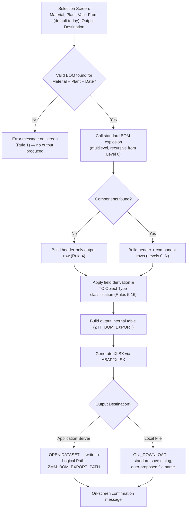

# Technical Specification

## 1. Document Control
| Field | Value |
|---|---|
| Object ID | MM-RPT-002 |
| Object Name (Technical) | ZMM_BOM_EXPORT |
| RICEFW Type | Report |
| Linked Functional Spec Ref | FunctionalSpec_MM-RPT-002.md |
| Linked Solution Architect Ref | SolutionArchitect_MultilevelBOMExcelExport.md |
| Author | SAP-SDLC (AI-assisted, Technical Consultant/Developer profile) |
| Version | 1.0 |

### Version History
| Version | Date | Changed By | Change Summary | Status at time |
|---|---|---|---|---|
| 1.0 | 2026-09-17 | shilpiverma.iin@gmail.com | Initial creation | Draft |

## 2. Development Object Overview
- Object type: custom ABAP executable report with its own transaction code
- Naming convention used: `config/naming-standards.json`, Module `MM`, Purpose `BOM_EXPORT`
- Package: `ZMM_BOM`
- Transport: one Workbench Request (program, transaction, data dictionary objects, message class) + one Customizing Request (Logical File Path/Name configuration)

## 2a. Reuse Assessment (Revisited)
| Check | AI Finding | User Response | Status | Notes |
|---|---|---|---|---|
| Another FS/TS for 1SAP with predominantly the same functionality? (all WRICEF inventories considered) | No other Functional Spec/Technical Spec exists in this repository's `Artifacts/` folder covering overlapping functionality | Confirmed — no overlap | ✅ Accepted | Sole requirement for multilevel BOM Excel export |
| WRICEF previously developed in another system? | An existing custom report at this client was identified during Solution Architect as a design-pattern reference (name parked in FS Section 10 for this document, not repeated here); no full prior build confirmed in another system | No, not built elsewhere | ✅ Accepted | Pattern-level reuse only, not a directly reusable object |

## 2b. Clean Core Assessment (Mandatory)
| Check | AI Finding | User Response | Status | Notes |
|---|---|---|---|---|
| Prefer released APIs, RAP, CDS, ABAP Cloud over classic techniques? | Classic ABAP report approach already fixed in the Solution Architect write-up, driven by the confirmed ECC on-premise, classic-ABAP-first landscape | N/A — approach fixed in Solution Architect write-up | Accepted (inherited) | See `SolutionArchitect_MultilevelBOMExcelExport.md` Section 4, Finalized Solution Approach |
| Any direct modification of an SAP standard object? (must be avoided) | None — new custom object only; standard tables/function modules are read/called as-is, never modified | Confirmed — no modifications | ✅ Accepted | No SAP standard object modified |
| Any unreleased/non-strategic API used? (must be avoided, or justified if unavoidable) | Use of classic function modules (e.g. the standard BOM explosion FM) is inherent to the classic-ABAP approach fixed upstream | N/A — approach fixed in Solution Architect write-up | Accepted (inherited) | Standard, unmodified FMs called via straightforward calls |

## 2c. Object Inventory & Impacted Components
| Object Name | Type | New or Impacted | Description |
|---|---|---|---|
| ZMM_BOM_EXPORT | Report (Program) | New | Main executable report — selection screen, orchestrates explosion and export |
| ZMM001 | Transaction Code | New | Transaction code assigned to the report |
| ZST_BOM_EXPORT | Structure | New | Output row structure (17 fields, per FS Section 7) |
| ZTT_BOM_EXPORT | Table Type | New | Internal table type based on `ZST_BOM_EXPORT` |
| ZMM_BOM_EXPORT | Message Class | New | Custom messages for validation/error handling |
| ZMM_BOM_EXPORT_PATH | Logical File Path (Customizing) | New | Logical path definition pointing to the physical application-server directory |
| ZMM_BOM_EXPORT_FILE | Logical File Name (Customizing) | New | Logical file name definition, referencing the logical path |
| ZMM_BOM | Development Package | New | Package containing all objects above |

## 3. Build Approach
- Build approach selected: new custom classic ABAP executable report (selection-screen driven), with its own transaction code.
- Justification: directly follows the classic-ABAP, on-premise ECC approach finalized in the Solution Architect write-up. The Clean Core preference for RAP/CDS/released APIs does not apply here, given the confirmed ECC on-premise, classic-ABAP-first landscape — recorded as an inherited deviation in Section 2b above, not re-litigated in this document.
- UI style: the selection screen follows standard ABAP selection-screen conventions (standard `SELECTION-SCREEN` framework, standard F4 help on Material/Plant fields, a standard radio-button group for the output-destination choice) — consistent with SAP's standard UI conventions for classic reports.

## 4. Data Model
| Object | Type | Fields | Key Fields |
|---|---|---|---|
| ZST_BOM_EXPORT | Structure | BOM Level, Teamcenter Object Type, Siemens Product Number, Normbyte, Position Number, Component Number, Material Description, Sort String, BOM Header Text, Object Dependencies, Position BOM Text, Component Quantity, Component Unit of Measure, Item Category, Costing Relevancy Indicator, BOM Status, Plant-Specific Material Status (17 fields total, matching FS Section 7 exactly) | None — output-only structure, not a persistence table |
| ZTT_BOM_EXPORT | Table Type | Standard table of `ZST_BOM_EXPORT` | N/A |

No other new Z-tables are needed — this report reads directly from standard SAP master data tables (Section 6) and does not persist any data of its own.

## 4a. Program Definition(s)
| Field | Program 1 (ZMM_BOM_EXPORT) |
|---|---|
| Common or New Program? | New |
| Application | MM (Materials Management), cross-referencing PP-owned BOM master data |
| Development Class | ZMM_BOM |
| Authorization Group | None — standard `S_TCODE` transaction-start authorization only (per FS Section 9); no custom program authorization group required |
| SAP Transaction(s) | ZMM001 (new); related reference transactions: CS03 (Display Material BOM), CS12 (Multi-Level BOM) |
| Program Description | Selection-screen-driven report that explodes a single material's multilevel BOM (Level 0 downward) at a given plant and validity date, derives the required output fields per FS Section 6, and exports the result to Excel — to the application server (configured logical path) or as a local download, per user choice |
| Input/Output Files | Input: none (interactive selection screen only). Output: one `.xlsx` file per execution, named `<Material Number>_<YYYY>_<MM>_<DD>.xlsx`, written to either the application server (Logical File Path `ZMM_BOM_EXPORT_PATH`) or the user's local machine |
| Program Flow (diagram/description) | See Section 5 |

## 5. Program / Processing Logic Design

**FS Rule → Technical Implementation Mapping**
| FS Rule Ref | Business Rule (from FS) | Technical Implementation |
|---|---|---|
| Rule 1 | Material/Plant/Valid-From must resolve to an existing BOM | Call the standard BOM explosion FM; check the return status/result set; if not found, raise an error via message class `ZMM_BOM_EXPORT` and terminate processing (no output) |
| Rule 2 | BOM level numbering (Level 0, 1, 2, …) | Populate the BOM Level field from the explosion FM's returned hierarchy level indicator for each row |
| Rule 3 | Multilevel recursive explosion | Standard BOM explosion FM invoked with the multilevel explosion parameter set; no custom recursion needed — reuses standard SAP capability |
| Rule 4 | Header-only output when no components | After explosion, if the component result set is empty, still populate and output one row representing the BOM header only |
| Rules 5–12 | Teamcenter Object Type classification (5-step decision logic) | Implemented in a local class method (`LCL_TC_CLASSIFIER=>determine_object_type`), executed once per output row, applying the exact sequential criteria from FS Rules 5–12 against item category, material number pattern, class assignment (via the standard classification lookup path), and stock quantity |
| Rule 13 | Long-text handling, all lines stacked in one cell, German language | Local class method (`LCL_TEXT_READER=>get_stacked_text`) retrieves all relevant text lines via the standard text-read function module(s) (Section 6), concatenated with line breaks within the single output cell, restricted to German-language texts |
| Rule 14 | Object dependency lookup for non-text-line components | Local class method (`LCL_BOM_EXPLODER=>get_object_dependencies`) implementing the multi-step lookup per FS Section 6b |
| Rule 15 | Remove leading zeroes from Position Number | Standard ABAP conversion applied when populating the Position Number output field |
| Rule 16 | Plant-specific material status for header + text-relevant components | Local class method reads the plant material status for the entered plant, restricted to the components flagged per FS's item-category condition |

## 6. Reference Objects Used
| Object Type | Object Name | Usage |
|---|---|---|
| Table | MARA | Material master read |
| Table | STPO | BOM item/component read |
| Table | STKO | BOM header read |
| Table | MARC | Plant-specific material status read |
| Table | STZU | BOM header text read |
| Table | STXH | Header & position long text index read |
| Table | INOB | Classification link read |
| Table | KSSK | Classification assignment read |
| Table | KLAH | Class header read |
| Table | CUOB | Object dependency link read |
| BAPI/FM | CS_BOM_EXPL_MAT_V2 | Standard multilevel BOM explosion |
| BAPI/FM | CUKD_GET_KNOWLEDGE | Object dependency knowledge retrieval |
| BAPI/FM | READ_TEXT / CSAP_MAT_BOM_READ | Long text retrieval |
| Third-party library | ABAP2XLSX | Generate a genuine Open XML `.xlsx` output file — build-time prerequisite, verify it is installed |
| FM | GUI_DOWNLOAD | Local file output |
| ABAP statement | OPEN DATASET / CLOSE DATASET | Application server file output |

## 7. Interface / Integration Design
Not applicable — no external system integration is in scope (confirmed in the Solution Architect write-up; Teamcenter is not an active integration point for this build).

## 8. UI / Output Technical Design
- **Selection screen**: standard `SELECTION-SCREEN` framework; parameters for Material Number (mandatory, standard material search help), Plant (mandatory, standard plant search help), Valid-From Date (mandatory, defaulted to the system date), and a radio-button group for Output Destination (Application Server / Local File); a logical-path selection field is shown/enabled only when Application Server is chosen.
- **Output**: not an ALV/list-based screen — the deliverable is the Excel file itself (per FS Section 7); on-screen feedback is limited to confirmation/error messages.
- **File generation**: build the internal table (`ZTT_BOM_EXPORT`) row by row per Section 5, pass it to ABAP2XLSX to construct the workbook (single worksheet, one row per BOM line, columns in the exact order from FS Section 7), convert to a binary stream, then route to `GUI_DOWNLOAD` (local) or `OPEN DATASET` in binary mode (application server) based on the user's selection.

## 9. Error Handling (Technical)
- **Message class**: new message class `ZMM_BOM_EXPORT`, with a distinct message number for each FS Section 8 error/warning (No BOM found, Material invalid, Plant invalid, header-only warning, logical path inaccessible, local save failure).
- **Logging approach**: on-screen `MESSAGE` statements only (types E/W/I as appropriate), consistent with the FS's confirmed "on-screen message only" notification strategy — no Application Log (BAL) or custom Z-log table, since the FS explicitly ruled out a dedicated error report.

## 10. Authorization Design
- Standard `S_TCODE` authorization object check for transaction `ZMM001` (the default SAP-generated check when the transaction is created) — no additional custom authorization object, per the FS's confirmed "standard transaction-code authorization only."
- No custom authorization group assigned to the program.
- The underlying standard function module calls (BOM explosion, material reads) carry their own standard SAP authorization checks inherently; no additional design is needed here.

## 10a. Transport Strategy
- One **Workbench Request** for MM-RPT-002, containing: program `ZMM_BOM_EXPORT`, transaction code `ZMM001`, structure `ZST_BOM_EXPORT`, table type `ZTT_BOM_EXPORT`, message class `ZMM_BOM_EXPORT`, package `ZMM_BOM`.
- One **Customizing Request** for MM-RPT-002, containing: Logical File Path `ZMM_BOM_EXPORT_PATH` and Logical File Name `ZMM_BOM_EXPORT_FILE` definitions — this configuration is a Basis-team dependency, as flagged in the Solution Architect write-up.
- Both transport descriptions must include "MM-RPT-002", per `naming-standards.json`'s transport naming rule.

## 11. Performance Considerations
- Given standard/moderate volumes (confirmed in the Solution Architect write-up) and the single-material-per-run design, expected response time is well within typical interactive-report tolerances; no hard SLA was specified (FS Section 10).
- Most efficient data source per lookup: use the standard BOM explosion FM directly rather than custom recursive `SELECT` loops — the FM returns the full multilevel hierarchy in one call, avoiding repeated database round-trips per level.
- Most efficient method to pull data: buffer/batch material master (`MARA`) and plant-status (`MARC`) reads using a single `SELECT ... FOR ALL ENTRIES` against the distinct set of component material numbers returned by the explosion, rather than reading per-component row individually — reduces database round-trips proportional to component count.

## 12. Unit Test Design
| # | Test Case | Method/Class | Expected Result |
|---|---|---|---|
| 1 | Determine TC Object Type for a text-line item | `LCL_TC_CLASSIFIER=>determine_object_type` | Returns "Text Line" classification |
| 2 | Determine TC Object Type for a stocked "P*" material | `LCL_TC_CLASSIFIER=>determine_object_type` | Returns "Component Part" classification |
| 3 | Determine TC Object Type for a non-"P*" material in a relevant class | `LCL_TC_CLASSIFIER=>determine_object_type` | Returns "Component Part" classification |
| 4 | Determine TC Object Type for a non-"P*", non-classed, non-stocked material | `LCL_TC_CLASSIFIER=>determine_object_type` | Returns "Software" classification |
| 5 | Position Number leading-zero removal | Local formatting routine | "000123" input returns "123" output |
| 6 | Stacked long-text retrieval, multiple lines | `LCL_TEXT_READER=>get_stacked_text` | All German-language lines returned, concatenated in original order |
| 7 | Header-only output when zero components | Main processing routine | Output table contains exactly one row (header), no component rows |

## 12a. Component Test Plan
| # | Acceptance Test Criteria | Master/Transactional Data Used | Expected Result | Actual Result |
|---|---|---|---|---|
| 1 | Full run for a material/plant/date with a valid multilevel BOM (3+ levels) | Material with multilevel BOM (3+ levels), valid plant | Correct header + all levels/components, correctly classified and formatted; single `.xlsx` file produced | (to be recorded in /Code) |
| 2 | Full run for a material/plant/date with a valid BOM header but zero components | Material with BOM header, no components | Header-only `.xlsx` output, no error | (to be recorded in /Code) |
| 3 | Full run choosing Application Server output | Same as #1 | File written to the configured logical path with the correct file name; on-screen confirmation | (to be recorded in /Code) |
| 4 | Full run choosing Local File output | Same as #1 | Standard save dialog with correct auto-proposed file name; file saved to the selected location | (to be recorded in /Code) |
| 5 | Run for a material/plant/date combination with no BOM | Non-existent BOM combination | On-screen error message; no output file | (to be recorded in /Code) |
| 6 | Run for a non-existent material or invalid plant | Invalid material/plant values | On-screen error message; no output file | (to be recorded in /Code) |

---
**Next step:** Run `/Code` referencing this document (Object ID: MM-RPT-002) to build and unit-test the object.
